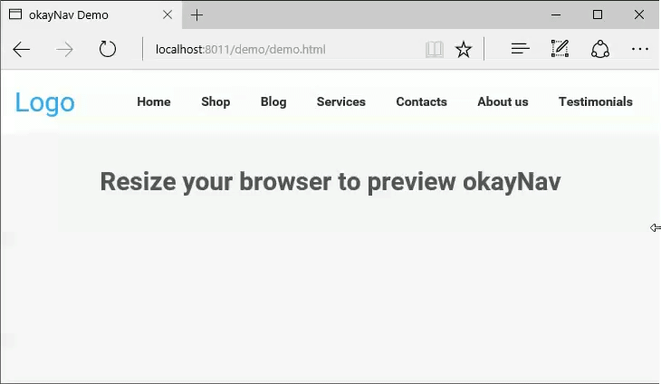

#okayNav jQuery Plugin

[](https://gitter.im/VPenkov/okayNav?utm_source=badge&utm_medium=badge&utm_campaign=pr-badge&utm_content=badge)
You know how navigations have only a desktop and a mobile state, right? I thought, "this might cost people money because it requires additional click for users to reach even the most important pages."

This navigation aims at progressively collapsing navigation links into an off-screen navigation instead of doing it for all the links at the same time. Check out this example:



Or play with it on [CodePen](http://codepen.io/VPenkov/pen/wMZBOg).

## How to Use
This is the code used in the example:
```html
<header id="header">
    <a class="site-logo" href="#">
       Logo
    </a>
    
    <nav role="navigation" id="nav-main" class="okayNav">
        <ul>
            <li><a href="#">Home</a></li>
            <li><a href="#">Shop</a></li>
            <li><a href="#">Blog</a></li>
            <li><a href="#">Services</a></li>
            <li><a href="#">Contacts</a></li>
            <li><a href="#">About us</a></li>
            <li><a href="#">Testimonials</a></li>
        </ul>
    </nav>
</header><!-- /header -->
```
Include the CSS:
```html
<link rel="stylesheet" href="css/okayNav.css" media="screen">
```
Include the library:
```html
<script src="js/jquery.okayNav.min.js"></script>
```

And here's the JS to initialize it:
```javascript
var navigation = $('#nav-main').okayNav();
```

## Dependencies
okayNav depends on jQuery. Tested with jQuery 1.10+ but should work with lower versions.
The stylization of okayNav comes in a commented LESS and CSS.

## Browser Support
okayNav supports IE9+, Firefox, Chrome. Transitions work in IE10+.

## Default options
```javascript
var navigation = $('#nav-main').okayNav({
	parent : '', // will call nav's parent() by default
    toggle_icon_class : 'okayNav__menu-toggle',
    toggle_icon_content: '<span /><span /><span />',
    align_right: true, // If false, the menu and the kebab icon will be on the left
    swipe_enabled: true, // If true, you'll be able to swipe left/right to open the navigation
    threshold: 50, // Nav will auto open/close if swiped >= this many percent
    beforeOpen : function() {}, // Will trigger before the nav gets opened
    afterOpen : function() {}, // Will trigger after the nav gets opened
    beforeClose : function() {}, // Will trigger before the nav gets closed
    afterClose : function() {}, // Will trigger after the nav gets closed
    itemHidden: function() {}, // Will trigger after an item moves to the hidden navigation
    itemDisplayed: function() {} // Will trigger after an item moves to the visible navigation
});
```

## Methods
Open the off-screen part: ``navigation.okayNav('openInvisibleNav');``

Close the off-screen part``navigation.okayNav('closeInvisibleNav');``

Toggle the off-screen part``navigation.okayNav('toggleInvisibleNav');``

Recalculate what should be visible and what shouldn't: ``navigation.okayNav('recalcNav');``

Get the nav's parent element: ``navigation.okayNav('getParent');``

Get the nav's visible part: ``navigation.okayNav('getVisibleNav');``

Get the nav's off-screen part: ``navigation.okayNav('getInvisibleNav');``

Get the nav's toggle icon: ``navigation.okayNav('getNavToggleIcon');``

Get the nav children's total width: ``navigation.okayNav('getChildrenWidth');``

Destroy the nav, make everything visible, disable all events: ``navigation.okayNav('destroy');``

## Roadmap
The following features will be implemented at the next versions:
- AMD/CommonJS support
- Multi-level navigation
- Option to prioritize certain nav items
- Option to hide or show all nav items instead of doing it progressively

Pull requests are appreciated.

## License
Licensed under the [MIT License](https://opensource.org/licenses/MIT).

## Support
Please use the GitHub issues for support requests. If you need someone to implement okayNav for you, hit me up at [vergil@moongrab.com](vergil@moongrab.com).

## Changelog
**2.0.1**
- Flexbox is now optional; nav will work with floats too;
- Resolved a bug when maximizing the browser.

**2.0.0**
- Swipe actions are now available;
- Swipe can be enabled or disabled;
- You can adjust the threshold after which the swipe action will trigger;
- Added extra callbacks;
- Callbacks are now camelCased;
- The beforeOpen/beforeClose callbacks now only trigger if swipe is disabled (for obvious reasons).

[Scroll up](#default-options) to see the defaults for more information!

**1.0.2**
Resize events are now a lot more efficient

**1.0.1**
First public version

## Tell me what you've created
Ping me on [Facebook](http://fb.com/vergil.penkov) or [Twitter](http://twitter.com/vergilpenkov). I'd definitely love to see what you've done with okayNav!

## Contributors
Many thanks to [@Bloodb0ne](https://github.com/bloodb0ne) for the enormous help with swipe actions!

## Buy me a beer
I appreciate good beer and good coffee. If you find this plugin useful and want to say thanks, there's no better way to do it. My PayPal is [vergil@moongrab.com](vergil@moongrab.com).